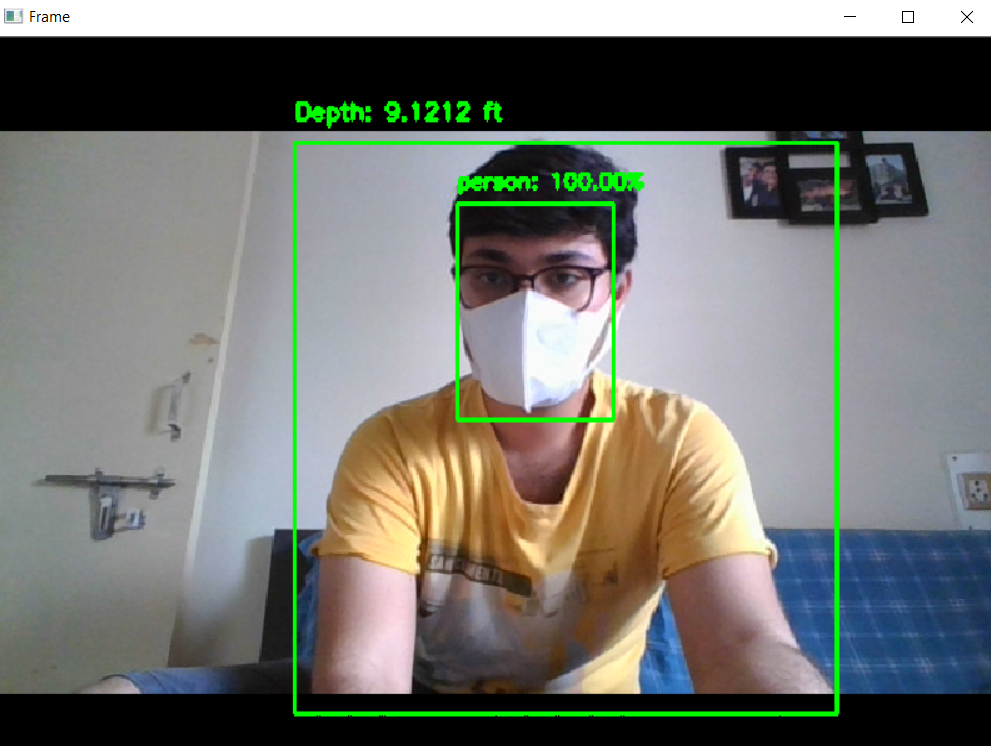
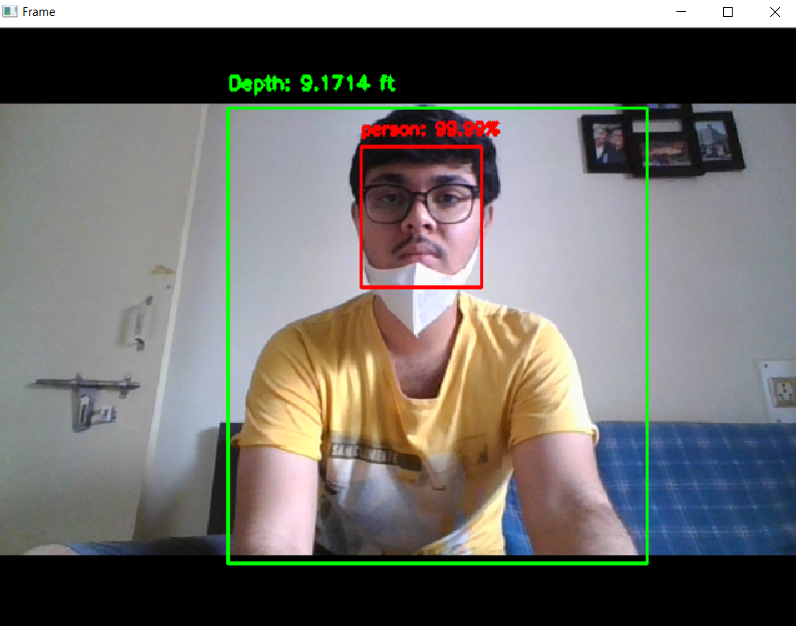
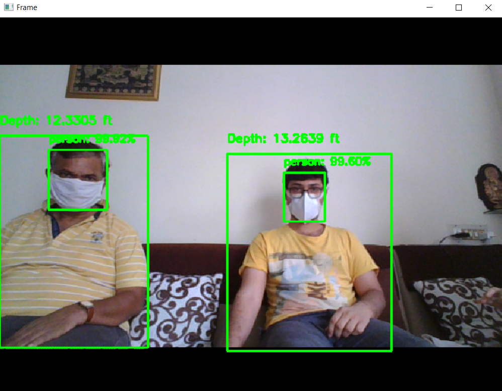
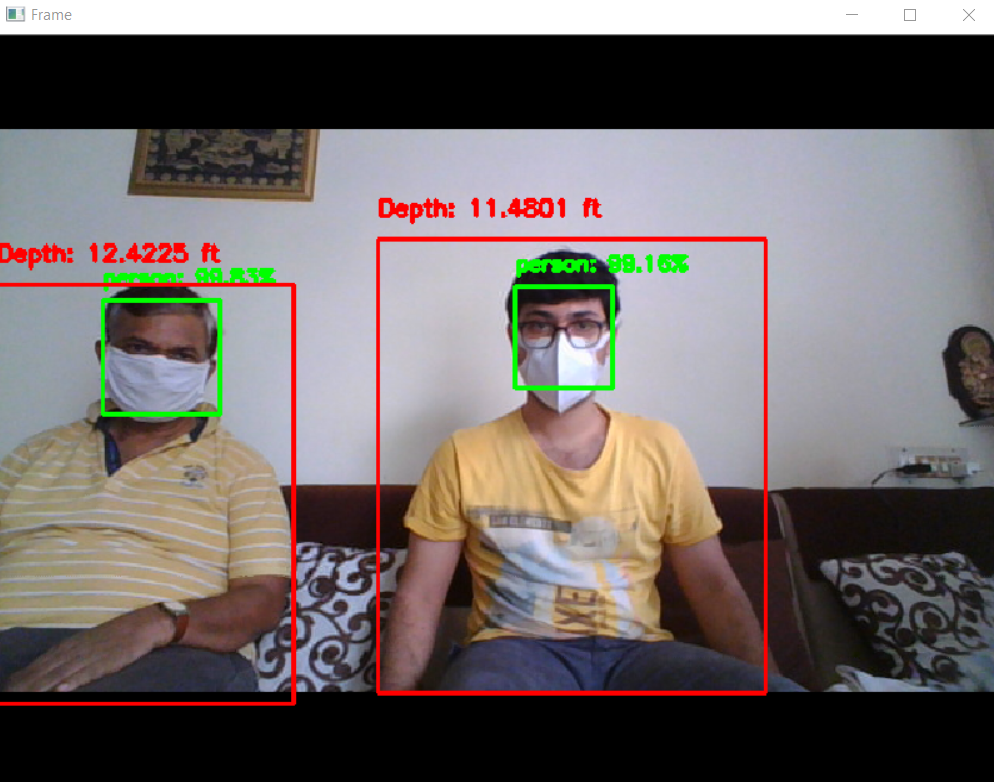

# Resister-19
### A project by Team RESISTER-19 for the HackForCovid Hackathon

## Title : Social Distancing & Face Mask Detector with Alarm

## Tagline
Masks on their own will not protect you from covid'19,  practising physical distancing with mask can!<br>
Our project ensures these 2 practises with alarm sound.

## The Problem It Solves
Social Distancing and wearing masks have become the 2 most popular terms in today's life to keep oneself safe from getting infected from the Novel Coronavirus. Researchers have concluded that these 2 practises are the warriors against Covid. Governments across the nation are rigorously making efforts to make these 2 practises in action. We as a team came up to a real time solution of detecting social distance between humans and detecting persons with no mask covering. This solution was needed as there is a lack of awareness among people about the major precautions which is Mask+Distance.  Neither only mask can save, nor only distancing can save you but the aggregation of these two can. <br><br>
In our project we have proposed 2 major solutions (i) Mask Covering (ii) Ensuring safe (physical/social) distance between people which is in real time.<br><br>

## Major Functionalities:
<b>(I) Face Covering:</b> The camera detects people with mask and without mask which is differentiated by green and red boxes respectively. On detecting a person without mask or face covering the system beeps an alert sound. <br><br>
<b>(II) Social Distancing:</b> Similarly, the system calculates distance among multiple people and highlights boxes of red and green color indicating that the red box is not maintaining safe distance whereas green is.<br><br>
<b>(III) Alarm:</b> On disobeying any of the precautions an alarm alert is triggered i.e
       <br>(1) If a person has not maintained distance and has no face covering
       <br>(2) The person has maintained distance but has no face covering
       <br>(3) The person has face covered but has not maintained distancing.
<br><br>This system is useful as it can be implemented on road cameras/malls/etc. using IOT functionaties and check which areas are disobeying the rules and steps can be taken accordingly and people who have unknowingly broken the rule can be cautioned by an alarm/alert at that time itself.

## Challenges We Ran Into
The project itself was the great challenge for us as making a whole system which detects face covering and physical distancing in <50 hrs is not easy. This challenge was created with the vision of developing a real-time physical distance detection system with face covering available for public use, to help public health officials all over the world to ensure 2 major precautions. <br><br>
There were 4 major challenging challenges faced. <br>
<b>i. Collecting Data</b> - No data set of people with masks was available, therefore we scraped the data from the web (Web Scraping) of persons with masks and obtained few images.<br>
<b>ii. Training Data</b> - As web scraped the data only few images were obtained so for training we have to use a pre-trained model i.e MobilenetV2 <br>
<b>iii. Integration of 2 different modules</b> - As mask detection only focuses on face covering and social distancing focuses on 2 distance between persons. On integration we have to work on 2 things simultaneously (1) Mask covering (2) Calculate distance between 2 persons on real time. <br>
<b>iv. Calculation of Euclidean distance</b> - This was a new thing for us which took more time comparatively. <br>

## Technologies We Used
1. Computer Vision <br>
2. Open-CV <br>
3. Tensorflow <br>
4. Deep Learning <br>
5. Convolution Neural Network <br>


## Photos
  
<br><br>   

## Set Up

To begin with, use the requirements.txt file to install the dependencies.
```
pip install -r requirements.txt
```

## Execute

Use the following command to execute the code.
```
python social_distance_detection.py --prototxt SSD/SSD_MobileNet_prototxt.txt --model SSD/SSD_MobileNet.caffemodel --labels SSD/class_labels.txt --alarm alarm.wav
```


